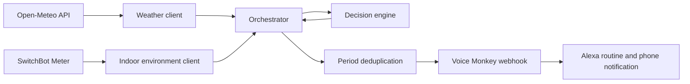

# Smart Home QA Harness

[](https://github.com/lucasbezerranegot/smart-home-qa-harnes/actions/workflows/qa_pipeline.yml)

A serverless-oriented Python 3.12 application that recommends window actions from outdoor and indoor environmental data. The project is designed as a QA automation portfolio: deterministic business rules, isolated HTTP clients, mocked external services, structured failures, branch coverage, and an automated CI quality gate.

The current MVP reads outdoor temperature from Open-Meteo, indoor temperature and humidity from a SwitchBot Meter, evaluates ventilation rules, and can trigger Alexa routines through Voice Monkey.

## Architecture



External HTTP behavior is kept separate from business logic. Tests can therefore simulate timeouts, malformed responses, HTTP errors, and device failures without contacting real services.

## Engineering decision: Alexa to SwitchBot

The initial plan was to reuse the temperature sensor already available through an Echo device. During discovery, that route did not provide a suitable public integration path for reading the sensor from this Python application. Instead of coupling the project to an unofficial workaround, the MVP moved to a SwitchBot Hub Mini and Meter with a documented OpenAPI.

That decision expanded the project beyond temperature: the Meter also supplies humidity, and the same ecosystem can support future winter ventilation rules and radiator-thermostat automation. It is an example of adapting architecture after validating a real integration constraint rather than hiding the constraint in a demo.

## Decision rules

Time boundaries are inclusive.

| Period | Condition | Result |
|---|---|---|
| 18:00–23:00 | Outside temperature is lower than inside | `OPEN_WINDOWS` |
| 06:00–11:00 | Outside temperature is greater than or equal to inside | `CLOSE_WINDOWS` |
| 06:00–11:00 | Outside temperature is at least 24°C | `CLOSE_WINDOWS` |
| Any other scenario | No rule matches | `NO_ACTION` |

Examples:

| Scenario | Time | Outside | Inside | Expected action |
|---|---:|---:|---:|---|
| Evening cooling | 20:00 | 18°C | 24°C | `OPEN_WINDOWS` |
| Equal evening temperatures | 20:00 | 24°C | 24°C | `NO_ACTION` |
| Outside warmer in morning | 10:00 | 23°C | 22°C | `CLOSE_WINDOWS` |
| Morning heat threshold | 10:00 | 24°C | 25°C | `CLOSE_WINDOWS` |
| Useful morning cooling | 10:00 | 23°C | 25°C | `NO_ACTION` |

## Reliability behavior

Clients translate library and provider failures into application-level exceptions containing:

- a stable error code;
- a readable message;
- a `retryable` flag.

Covered failure scenarios include:

- request timeout and connection failure;
- HTTP 401, 429, and 500 responses;
- malformed JSON and changed payload structure;
- invalid temperature, humidity, timestamp, and device identifiers;
- SwitchBot application errors inside HTTP 200 responses;
- SwitchBot response data belonging to a different device;
- webhook failure after a valid recommendation.

The orchestrator stops safely when required data is unavailable. It does not call the decision engine or webhook after an upstream failure, and it marks a webhook as sent only after the request succeeds.

## Notification deduplication

The MVP creates one notification key per date and action period:

```text
2026-08-30:morning
2026-08-30:evening
```

A successful webhook stores the key; a failed webhook does not. Repeated executions in the same period suppress additional Alexa and phone notifications.

The current store is an injected in-memory `set`. This demonstrates and tests the policy but does not survive a serverless cold start. A persistent implementation such as DynamoDB is planned for deployment.

## Quality gates

- Python 3.12
- pytest unit tests
- all external HTTP calls mocked with `responses` or `unittest.mock`
- branch coverage enabled
- minimum total coverage: 90%
- 100% test pass rate required
- GitHub Actions on pushes to `main` and pull requests
- read-only real-device smoke test kept outside CI
- opt-in end-to-end smoke test with an explicit interactive confirmation

Current local result:

```text
119 passed
99.69% total coverage
```

## Local setup

Copy the example configuration and provide local values:

```bash
cp .env.example .env
```

The SwitchBot device ID must be written without MAC-address separators:

```text
App: AA:BB:CC:DD:EE:FF
API: AABBCCDDEEFF
```

Never commit `.env`. It is ignored by Git; `.env.example` contains names and safe examples only.

## Run the quality gate with Docker

Docker provides the required Python 3.12 runtime without changing the host Python installation:

```bash
docker run --rm \
  -v "$PWD:/app" \
  -w /app \
  python:3.12-slim \
  sh -c "pip install -q -r requirements-dev.txt && pytest \
    --cov=smart_home_qa_harness \
    --cov-report=term-missing"
```

## Read-only SwitchBot smoke test

The smoke test makes one real GET request to the configured SwitchBot Meter. It does not invoke Voice Monkey or Alexa.

```bash
docker run --rm \
  --env-file .env \
  -v "$PWD:/app" \
  -w /app \
  python:3.12-slim \
  sh -c "pip install -q -e . && python scripts/smoke_test_switchbot.py"
```

The smoke test is intentionally excluded from CI because it requires secrets, internet access, and online hardware.

## End-to-end Alexa smoke test

The end-to-end script reads current Open-Meteo data and the real SwitchBot Meter, runs the decision engine, and can continue through Voice Monkey to an Alexa routine and phone notification.

Its default mode is safe: it prints the real measurements and decision but does not enable a webhook trigger.

```bash
docker run --rm \
  --env-file .env \
  -v "$PWD:/app" \
  -w /app \
  python:3.12-slim \
  sh -c "pip install -q -e . && python scripts/smoke_test_end_to_end.py"
```

The trigger path requires two explicit controls: `ALLOW_REAL_ALEXA_TRIGGER=true` and an interactive action-specific confirmation. A forced action is available only for connectivity testing outside the normal morning/evening decision periods:

```bash
docker run --rm -it \
  --env-file .env \
  --env ALLOW_REAL_ALEXA_TRIGGER=true \
  --env SMOKE_FORCE_ACTION=OPEN_WINDOWS \
  -v "$PWD:/app" \
  -w /app \
  python:3.12-slim \
  sh -c "pip install -q -e . && python scripts/smoke_test_end_to_end.py"
```

The script then requires the operator to type the exact confirmation, for example `TRIGGER OPEN_WINDOWS`. Forced smoke actions do not modify or bypass the production decision engine; the override exists only in this manual script and is clearly reported in its output.

The complete path has been manually verified against real hardware and services: Open-Meteo → SwitchBot Meter → decision engine → Voice Monkey → Alexa voice announcement and phone push notification. Real readings, credentials, and device identifiers are intentionally not stored in the repository.

## Project structure

```text
src/smart_home_qa_harness/
├── application.py                 # Configuration and application wiring
├── decision_engine.py             # Pure window decision rules
├── inside_environment_client.py   # Static and SwitchBot providers
├── orchestrator.py                # Safe workflow and deduplication
├── weather_client.py              # Open-Meteo client
└── webhook_notifier.py            # Voice Monkey integration

tests/unit/                         # Deterministic unit tests and HTTP mocks
scripts/smoke_test_switchbot.py     # Manual read-only hardware verification
scripts/smoke_test_end_to_end.py    # Opt-in Alexa end-to-end verification
.github/workflows/qa_pipeline.yml   # CI quality gate
```

## Current scope and roadmap

The repository is a tested MVP and is serverless-oriented, but it is not yet deployed as a continuously running service.

Planned improvements:

- persistent notification state for cold-start-safe deduplication;
- scheduled serverless deployment;
- humidity-based winter ventilation rules;
- structured logging and operational monitoring;
- integration with the installed SwitchBot radiator thermostats.
