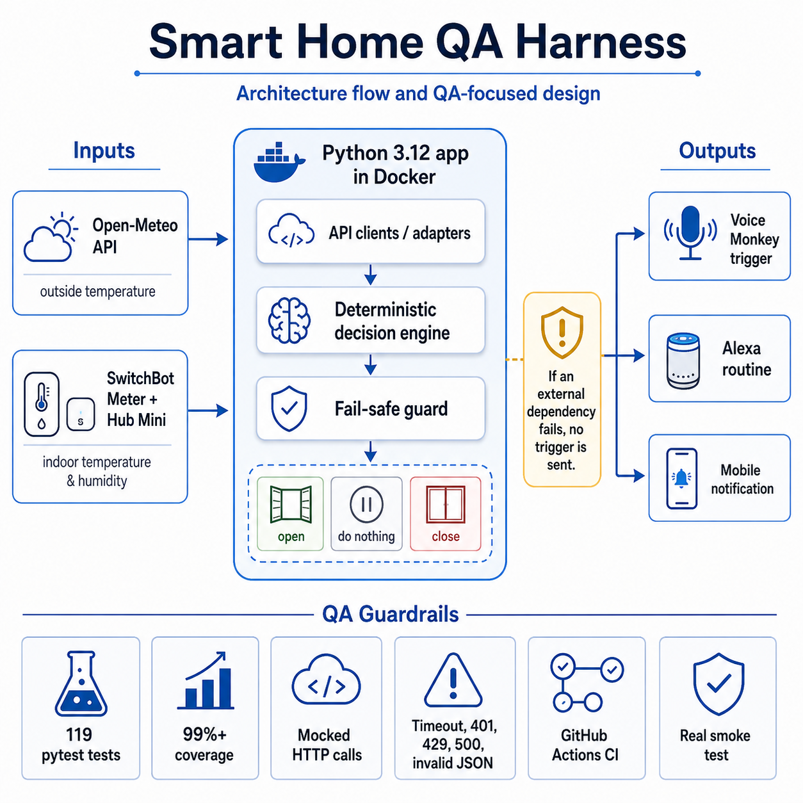

# Smart Home QA Harness

[](https://github.com/lucasbezerranegot/smart-home-qa-harness/actions/workflows/qa_pipeline.yml?query=branch%3Amain)

A containerized Python 3.12 application that recommends window actions from outdoor and indoor environmental data. The project is designed as a QA automation portfolio: deterministic business rules, isolated HTTP clients, mocked external services, structured failures, branch coverage, and an automated CI quality gate.

The current MVP reads outdoor temperature and today's forecast maximum from Open-Meteo, indoor temperature and humidity from a SwitchBot Meter, evaluates warm-day or humidity-based ventilation rules, and can trigger Alexa routines through Voice Monkey. A Linux systemd user timer runs a short-lived Docker container every 30 minutes during the morning and evening periods.

## Architecture



The application runs in Docker and combines Open-Meteo outdoor data with indoor temperature and humidity from a SwitchBot Meter. API clients feed a deterministic decision engine protected by fail-safe guards; valid decisions can trigger Voice Monkey, Alexa routines, and mobile notifications. The QA suite covers mocked HTTP behavior, error paths, CI checks, and a real smoke test.

The diagram shows the core data flow. The deployment adds a systemd timer and host-mounted persistent notification state:

```text
systemd user timer → Docker → Open-Meteo + SwitchBot → decision engine
                                                       ↓
                             host JSON reservation → Voice Monkey → Alexa + phone
```

GitHub Actions runs QA only; it is not the production scheduler. AWS/Lambda/DynamoDB experimental adapters were removed to keep the published implementation aligned with the actual deployment. The current deployment is self-hosted, not serverless, and requires the PC, Docker daemon, and internet connection to be available.

External HTTP behavior is kept separate from business logic. Tests can therefore simulate timeouts, malformed responses, HTTP errors, and device failures without contacting real services.

## Engineering decision: Alexa to SwitchBot

The initial plan was to reuse the temperature sensor already available through an Echo device. During discovery, that route did not provide a suitable public integration path for reading the sensor from this Python application. Instead of coupling the project to an unofficial workaround, the MVP moved to a SwitchBot Hub Mini and Meter with a documented OpenAPI.

That decision expanded the project beyond temperature: the Meter also supplies humidity, and the same ecosystem can support future winter ventilation rules and radiator-thermostat automation. It is an example of adapting architecture after validating a real integration constraint rather than hiding the constraint in a demo.

## Decision rules

Time boundaries are inclusive. The mode is selected from today's forecast maximum, not from the calendar season. Thresholds are module-level constants: 24°C for a warm day and 60% indoor relative humidity for cool-day ventilation.

| Mode | Period | Condition | Result |
|---|---|---|---|
| Warm day: maximum ≥ 24°C | 18:00–23:00 | Inside > 24°C AND outside < inside | `OPEN_WINDOWS` |
| Warm day: maximum ≥ 24°C | 06:00–11:00 | Outside ≥ inside OR outside ≥ 24°C | `CLOSE_WINDOWS` |
| Cool day: maximum < 24°C | Morning or evening | Indoor humidity ≥ 60% | `OPEN_WINDOWS` |
| Either mode | Any other scenario | No rule matches | `NO_ACTION` |

Examples:

| Scenario | Time | Daily maximum | Outside | Inside | Humidity | Action |
|---|---:|---:|---:|---:|---:|---|
| Summer cooling | 20:00 | 27°C | 18°C | 25°C | 50% | `OPEN_WINDOWS` |
| Already at summer comfort | 20:00 | 27°C | 18°C | 24°C | 50% | `NO_ACTION` |
| Outside warmer in morning | 08:00 | 27°C | 23°C | 22°C | 50% | `CLOSE_WINDOWS` |
| Cool day, high humidity | 08:00 | 18°C | 10°C | 21°C | 65% | `OPEN_WINDOWS` |
| Cool day, normal humidity | 20:00 | 18°C | 10°C | 21°C | 59.9% | `NO_ACTION` |
| Exact warm-day boundary | 08:00 | 24°C | 10°C | 21°C | 70% | `NO_ACTION` |

Cool-day recommendations are intended for short, manually supervised Stoßlüften, not leaving windows open all night. The MVP does not measure window state, schedule a closing reminder, or control radiator thermostats. Room-specific winter comfort temperatures (for example 20°C) are future configuration, not a currently enforced rule. Indoor humidity alone does not prove that outdoor air will reduce moisture; outdoor moisture/dew-point comparison is a planned refinement.

## Reliability behavior

Clients translate library and provider failures into application-level exceptions containing:

- a stable error code;
- a readable message;
- a `retryable` flag.

Covered failure scenarios include:

- request timeout and connection failure;
- HTTP 401, 429, and 500 responses;
- malformed JSON and changed payload structure;
- invalid temperature, humidity, timestamp, and device identifiers;
- SwitchBot application errors inside HTTP 200 responses;
- SwitchBot response data belonging to a different device;
- webhook failure after a valid recommendation.

The orchestrator stops safely when required data is unavailable. It does not call the decision engine or webhook after an upstream failure, and it marks a webhook as sent only after the request succeeds.

## Notification deduplication

The MVP creates one notification key per date and action period:

```text
2026-08-30:morning
2026-08-30:evening
```

The period is derived from the execution time, not from the action: opening windows can now be recommended in either period. Repeated executions suppress additional notifications, allowing at most one reserved attempt per period (up to two per day, not two mandatory notifications).

The injected `FileNotificationStore` writes keys to `.state/notifications.json` using a temporary file followed by replacement. Docker mounts that directory from the host, so state survives container removal and restarts.

The reservation is persisted **before** the webhook. This favors avoiding duplicate notifications: if sending fails or the process crashes after reserving, another execution in the same period is suppressed. It does not guarantee delivery or exactly-once behavior. The JSON adapter is intended for one local executor, not concurrent distributed writers; systemd does not start a second instance of the same active service.

## Quality gates

- Python 3.12
- pytest unit tests
- offline component-integration tests using the real parser, decision engine, orchestrator, notifier, and file store
- all external HTTP calls mocked with `responses` or `unittest.mock`
- branch coverage enabled
- minimum total coverage: 90%
- 100% test pass rate required
- GitHub Actions on pushes to `main` and pull requests
- read-only real-device smoke test kept outside CI
- opt-in end-to-end smoke test with an explicit interactive confirmation

Current local result:

```text
459 passed
93.65% total line/branch coverage
100% orchestrator coverage
```

## Local setup

Copy the example configuration and provide local values:

```bash
cp .env.example .env
```

The SwitchBot device ID must be written without MAC-address separators:

```text
App: AA:BB:CC:DD:EE:FF
API: AABBCCDDEEFF
```

Never commit `.env`. It is ignored by Git; `.env.example` contains names and safe examples only.

Protect the secrets file with `chmod 600 .env`. `.dockerignore` excludes secrets, notification state, Git metadata, and generated artifacts from the Docker build context.

## Local production execution

`Dockerfile.runtime` installs the application at build time and runs `scripts/run_scheduled_control.py`. The container never forces a decision. Build a candidate without overwriting the operational `runtime` tag:

```bash
docker build -f Dockerfile.runtime -t smart-home-qa-harness:candidate .
```

A candidate execution uses real APIs and can send a real Alexa notification when a rule matches:

```bash
mkdir -p .state
docker run --rm \
  --user "$(id -u):$(id -g)" \
  --env-file .env \
  -v "$PWD/.state:/app/.state" \
  smart-home-qa-harness:candidate
```

Keep `.state` owned by the host user. Do not share production state with tests; integration tests use pytest's temporary directories.

### systemd scheduling

Versioned unit examples are in `deploy/systemd/`. Adjust the repository path, Docker path, and UID:GID before copying them into `~/.config/systemd/user/`. The timer uses the host's local timezone; this deployment expects Europe/Berlin.

- Morning: 06:00, 06:30, …, 10:30.
- Evening: 18:00, 18:30, …, 22:30.
- Exact 11:00/23:00 runs are omitted because startup delay would put execution past the inclusive boundary.
- `Persistent=true` can catch up a missed run; outside permitted periods the decision engine returns `NO_ACTION`.

After installing the units and a tested `runtime` image:

```bash
systemd-analyze --user verify ~/.config/systemd/user/smart-home-qa.{service,timer}
systemctl --user daemon-reload
systemctl --user enable --now smart-home-qa.timer
sudo loginctl enable-linger "$USER"
systemctl --user list-timers smart-home-qa.timer
journalctl --user -u smart-home-qa.service -n 30 --no-pager
```

The room-aware humidifier runner has its own five-minute timer because its
11:30–14:00 and 19:00–08:00 operating periods differ from the ventilation
notification schedule. Install it only after real-device verification and
after explicitly setting `ALLOW_REAL_HUMIDIFIER_COMMANDS=true` in the protected
runtime `.env`:

```bash
cp deploy/systemd/smart-home-room-control.{service,timer} \
  ~/.config/systemd/user/
systemd-analyze --user verify \
  ~/.config/systemd/user/smart-home-room-control.{service,timer}
systemctl --user daemon-reload
systemctl --user enable --now smart-home-room-control.timer
systemctl --user list-timers smart-home-room-control.timer
journalctl --user -u smart-home-room-control.service -n 30 --no-pager
```

The runner evaluates the time and humidity rules on every invocation. Outside
the allowed humidifier periods it requests the safe `OFF` state. Disable the
automation with `systemctl --user disable --now
smart-home-room-control.timer`.

Linger keeps the user manager available after logout and at boot; it does not prevent PC suspension. A successful oneshot service returns to `inactive (dead)`, while the timer stays `active (waiting)`. Ensure Docker starts at boot. To stop scheduling: `systemctl --user disable --now smart-home-qa.timer`.

### Controlled release and rollback

Develop on a feature branch, run the full quality gate, and merge the reviewed change into `main`. Build releases from the clean, tested main commit using a commit-specific image tag. Validate the candidate before changing `runtime`.

```bash
# Run only as an intentional deployment after candidate validation.
docker tag smart-home-qa-harness:runtime smart-home-qa-harness:rollback
docker tag smart-home-qa-harness:candidate smart-home-qa-harness:runtime
```

The next timer execution uses the promoted image. Switching branches or editing source files does not change an already built image. To roll back, retag `smart-home-qa-harness:rollback` as `smart-home-qa-harness:runtime`. Local tests never overwrite `runtime`.

## Run the quality gate locally

Install the development dependencies and run the tests with branch coverage:

```bash
python -m pip install -r requirements-dev.txt
pytest --cov=smart_home_qa_harness --cov-report=term-missing
```

## Run the quality gate with Docker

Docker provides the required Python 3.12 runtime without changing the host Python installation:

```bash
docker run --rm \
  -v "$PWD:/app" \
  -w /app \
  python:3.12-slim \
  sh -c "pip install -q -r requirements-dev.txt && pytest \
    --cov=smart_home_qa_harness \
    --cov-report=term-missing"
```

## Read-only SwitchBot smoke test

The smoke test makes one real GET request to the configured SwitchBot Meter. It does not invoke Voice Monkey or Alexa.

```bash
docker run --rm \
  --env-file .env \
  -v "$PWD:/app" \
  -w /app \
  python:3.12-slim \
  sh -c "pip install -q -e . && python scripts/smoke_test_switchbot.py"
```

The smoke test is intentionally excluded from CI because it requires secrets, internet access, and online hardware.

## Room-aware ventilation and humidifier control

The room-aware path uses the numbered `ROOM_*` registry in `.env`. Every room
has exactly one Meter. `HAS_WINDOW=true` opts a room into ventilation, while
`HUMIDIFIER_PROVIDER` plus `HUMIDIFIER_DEVICE_ID` opt it into humidifier
control. This keeps the physical room/device mapping separate from the rules
that consume it. The room-level controller uses one provider-neutral contract;
SwitchBot Plug Mini and VeSync/Levoit are concrete adapters.

One cycle reads every configured Meter once. During a ventilation period it
evaluates every room with a window and groups all matching rooms into one
recommendation. A missing room reading is reported without preventing valid
rooms from being evaluated. The current production Alexa runner remains on the
legacy single-room path until dynamic room announcements are configured.

Humidifiers are allowed during the nap period `[11:30, 14:00)` and the
cross-midnight night period `[19:00, 08:00)`. They turn on below 45% relative
humidity, turn off at or above 50%, and retain their previous state between
those limits. Outside the allowed periods, or when the Meter reading is
unavailable, the safe desired state is off.

The new runner is dry-run by default:

```bash
PYTHONPATH=src python scripts/run_room_control.py
```

Real plug commands require the explicit environment gate:

```bash
ALLOW_REAL_HUMIDIFIER_COMMANDS=true \
  PYTHONPATH=src python scripts/run_room_control.py
```

After a command, the controller reads the plug status again and reports
`HUMIDIFIER_STATE_NOT_CONFIRMED` if the provider does not confirm the requested
physical state. Because cloud providers can briefly return stale state, the
controller retries confirmation after each delay configured in
`HUMIDIFIER_CONFIRMATION_RETRY_DELAYS_SECONDS` (for example,
`2,5,10,15`). It stops as soon as the desired state is confirmed; providers
that cannot confirm physical state are not polled repeatedly.
The Plug Mini's instantaneous power is recorded for future calibration only.
This version intentionally does not interpret low power as an empty water tank
and does not send a water notification.

For the children's-room Levoit humidifier registered in VeSync, configure
`ROOM_N_HUMIDIFIER_PROVIDER=vesync` and use the device's VeSync CID as
`ROOM_N_HUMIDIFIER_DEVICE_ID`. The registry rejects VeSync assignments to any
room other than `children-room`. The adapter also requires `VESYNC_USERNAME`,
`VESYNC_PASSWORD`, `VESYNC_COUNTRY_CODE`, and `VESYNC_TIME_ZONE`. VeSync is a
cloud integration, so both the application and humidifier need internet
access. `VESYNC_TIMEOUT_SECONDS` bounds every cloud operation. All five
`VESYNC_*` values come from runtime environment configuration; the adapter has
no built-in region, timezone, timeout, username, or password fallback.

The VeSync adapter reads the selected humidifier before a decision, sends only
the allow-listed power operation when the desired state differs, and reads the
device again through the common controller after a command. Authentication,
timeout, rate-limit, malformed-response, missing-device, offline-device, and
rejected-command failures are returned as structured error codes. Dry-run is
still the default and never sends a power command.

## Heating relay dry-run and controlled command

Enable and configure the required `HEATING_ZONE_*` entries in `.env`. Disabled
zones may remain incomplete. Each enabled zone maps one SwitchBot Meter to one
channel of a Relay Switch 2PM. The heating command is safe by default: it reads
the real Meter and relay status, prints the decision, and does not change the
relay.

```bash
docker run --rm \
  --env-file .env \
  -v "$PWD:/app" \
  -w /app \
  python:3.12-slim \
  sh -c "pip install -q -e . && python scripts/run_heating_control.py \
    --zone children-room"
```

A real command requires all three controls: `--apply`,
`ALLOW_REAL_HEATING_COMMANDS=true`, and the exact interactive confirmation.
The application reads the selected channel again after the command and fails
if the requested state is not confirmed.

```bash
docker run --rm -it \
  --env-file .env \
  --env ALLOW_REAL_HEATING_COMMANDS=true \
  -v "$PWD:/app" \
  -w /app \
  python:3.12-slim \
  sh -c "pip install -q -e . && python scripts/run_heating_control.py \
    --zone children-room --apply"
```

Do not schedule the `--apply` command until every zone has been verified in
dry-run mode against its physical relay device, channel, and Meter.

### Scheduled children-room pilot

The scheduled runner is intentionally restricted to a single enabled zone
named `children-room`. It also requires both
`HEATING_SCHEDULED_ZONE=children-room` and
`ALLOW_REAL_HEATING_COMMANDS=true`. Each execution writes one JSON result to
the systemd journal. The timer runs every five minutes and systemd does not
start another instance while the oneshot service is still active.

Review and install the versioned units only after validating the candidate
image and one manual real command:

```bash
cp deploy/systemd/smart-home-heating.{service,timer} \
  ~/.config/systemd/user/
systemd-analyze --user verify \
  ~/.config/systemd/user/smart-home-heating.{service,timer}
systemctl --user daemon-reload
systemctl --user enable --now smart-home-heating.timer
systemctl --user list-timers smart-home-heating.timer
journalctl --user -u smart-home-heating.service -n 30 --no-pager
```

Emergency stop:

```bash
systemctl --user disable --now smart-home-heating.timer
```

## End-to-end Alexa smoke test

The end-to-end script reads current Open-Meteo data and the real SwitchBot Meter, runs the decision engine, and can continue through Voice Monkey to an Alexa routine and phone notification.

Its default mode is safe: it prints the real measurements and decision but does not enable a webhook trigger.

```bash
docker run --rm \
  --env-file .env \
  -v "$PWD:/app" \
  -w /app \
  python:3.12-slim \
  sh -c "pip install -q -e . && python scripts/smoke_test_end_to_end.py"
```

The trigger path requires two explicit controls: `ALLOW_REAL_ALEXA_TRIGGER=true` and an interactive action-specific confirmation. A forced action is available only for connectivity testing outside the normal morning/evening decision periods:

```bash
docker run --rm -it \
  --env-file .env \
  --env ALLOW_REAL_ALEXA_TRIGGER=true \
  --env SMOKE_FORCE_ACTION=OPEN_WINDOWS \
  -v "$PWD:/app" \
  -w /app \
  python:3.12-slim \
  sh -c "pip install -q -e . && python scripts/smoke_test_end_to_end.py"
```

The script then requires the operator to type the exact confirmation, for example `TRIGGER OPEN_WINDOWS`. Forced smoke actions do not modify or bypass the production decision engine; the override exists only in this manual script and is clearly reported in its output.

The complete path has been manually verified against real hardware and services: Open-Meteo → SwitchBot Meter → decision engine → Voice Monkey → Alexa voice announcement and phone push notification. Real readings, credentials, and device identifiers are intentionally not stored in the repository.

## Project structure

```text
src/smart_home_qa_harness/
├── application.py                 # Configuration and application wiring
├── decision_engine.py             # Pure window decision rules
├── room_config.py                  # Shared room-to-device registry
├── ventilation_engine.py           # Room-aware ventilation decisions
├── room_ventilation_control.py     # Multi-room aggregation and failures
├── humidifier_engine.py            # Schedule and humidity hysteresis
├── humidifier_control.py           # Safe plug command orchestration
├── humidifier_provider.py          # Provider-neutral control contract
├── switchbot_plug_client.py        # Plug Mini EU status and commands
├── switchbot_humidifier_provider.py # SwitchBot implementation of the contract
├── vesync_humidifier_provider.py   # Levoit/VeSync implementation
├── room_control_application.py     # Shared Meter reads and controller wiring
├── inside_environment_client.py   # Static and SwitchBot providers
├── orchestrator.py                # Safe workflow and deduplication
├── notification_store.py          # Persistent JSON reservation adapter
├── weather_client.py              # Open-Meteo client
└── webhook_notifier.py            # Voice Monkey integration

tests/unit/                         # Deterministic unit tests and HTTP mocks
tests/integration/                  # Real component wiring with mocked HTTP
deploy/systemd/                     # Local service and timer examples
Dockerfile.runtime                  # Production image, dependencies installed once
scripts/run_scheduled_control.py    # One non-interactive control cycle
scripts/run_room_control.py         # Dry-run-first room-aware control cycle
scripts/smoke_test_switchbot.py     # Manual read-only hardware verification
scripts/smoke_test_end_to_end.py    # Opt-in Alexa end-to-end verification
.github/workflows/qa_pipeline.yml   # CI quality gate
```

## Current scope and roadmap

The repository is a self-hosted MVP with persistent notification state and forecast-selected cooling/humidity rules. The previous temperature-only Docker deployment has been manually verified through Alexa and mobile notifications. The seasonal revision is validated offline; real-device verification and image promotion remain separate release steps.

Planned improvements:

- outdoor humidity/dew-point comparison for more informed winter ventilation;
- room-specific winter comfort temperatures and closing reminders;
- calibrated humidifier load detection and low-water notifications;
- dynamic Alexa announcements containing the affected room names;
- notification delivery recovery and state retention/concurrency improvements;
- structured logging and operational monitoring;
- integration with the installed SwitchBot radiator thermostats.
